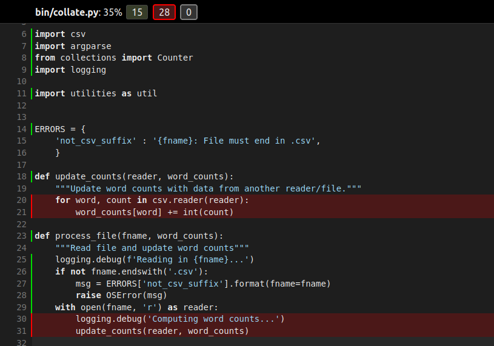

## 12.6.1. Set logging level
Define a new command-line flag for **collate.py** called `--verbose` (or `-v`) that changes the logging level from `WARNING` (the default) to `DEBUG` (the noisest level).

*Hint: the following command changes the logging level to `DEBUG`:*
```python
logging.basicConfig(level=logging.DEBUG)
```


```python
log_level = logging.DEBUG if args.verbose else logging.WARNING
logging.basicConfig(level=log_level)
```

```python
parser.add_argument('-v', '--verbose',
				   action='store_true', default=False,
				   help='Set logging level to DEBUG')
```

## 12.6.2. Send the logging output to file
In Exercise above, logging information is printed to the screen when the verbose flag is activated. This is problematic if we want to re-direct the output from **collate.py** to a CSV file, because the logging information will appearin the CSV file as well as the words and their counts.
1. Edit **collate.py** so that the logging information is sent to a log file called **collate.log** instead. *(HINT: `logging.basicConfig` has an argument called `filename`.)*

```python
logging.basicConfig(level=log_level, filename='collate.log')
```

2. Create a new command-line option `-l` or `--logfile` so that the user can specify a different name for the log file if they don't like the default name of **collate.log**.

```python
parser.add_argument('-l', '---logfile',
				   type=str, default='collate.log',
				   help='Specify a different name for the log file')
```

## 12.6.3. Handling exceptions
1. Modify the script **collate.py** so that it catches any exceptions that are raised when it tries to open files and records them in the log file. When you are finished, the program should collate all the files it can, rather than halting as soon as it encounters a problem.

```python
for fname in args.infiles:
	try:
		logging.debug(f'Reading in {fname}...')
		if not fname.endswith('.csv'):
			msg = ERRORS['not_csv_suffix'].format(fname=fname)
			raise OSError(msg)
		with open(fname, 'r') as reader:
			logging.debug('Computing word counts...')
			update_counts(reader, word_counts)
	except Exception as error:
		msg = f'{fname} not processed: {error}'
		logging.warning(msg)
```

2. Modify your first solution to handle nonexistent files and permission problems separately.

```python
for fname in args.infiles:
	try:
		logging.debug(f'Reading in {fname}...')
		if not fname.endswith('.csv'):
			msg = ERRORS['not_csv_suffix'].format(fname=fname)
			raise OSError(msg)
		with open(fname, 'r') as reader:
			logging.debug('Computing word counts...')
			update_counts(reader, word_counts)
	except FileNotFoundError as e:
		msg = f'{fname} not processed: File does not exist'
		logging.warning(msg)
	except PermissionError as e:
		msg = f'{fname} not processed: No read permission'
		logging.warning(msg)
	except Exception as error:
		msg = f'{fname} not processed: {error}'
		logging.warning(msg)
```

## 12.6.4. Testing error handling

1. It is diffcult to write a simple unit test for the lines of code dedicated to reading input files, because `main` is a long function that requires command-line arguments as input. Edit **collate.py** so that the six lines of code responsible for processing an input file appear in their own function that reads as follows (i.e., once you are done, `main` should called `process_file` in place of the existing code):

```python
def process_file(fname, word_counts):
	"""Read file and update word counts"""
	logging.debug(f'Reading in {fname}...')
	if not fname.endswith('.csv'):
		msg = ERRORS['not_csv_suffix'].format(fname=fname)
		raise OSError(msg)
	with open(fname, 'r') as reader:
		logging.debug('Computing word counts...')
		update_counts(reader, word_counts)
```

2. Add a unit test to **test_zipfs.py** that uses `pytest.raises` to check that the new `collate.process_file` raises an `OSError` if the input does not end in `.csv`. Run `pytest` to check that the new test passes.

```python
def test_not_csv_error():
    """Error handling test for csv check"""
    fname = 'data/time_machine.txt'
    word_counts = Counter()
    msg = util.ERRORS['not_csv_suffix'].format(fname=fname)
    with pytest.raises(OSError, match=msg):
        collate.process_file(fname, word_counts)
```

3. Add a unit test to **test_zipfs.py** that uses `pytest.raises` to check that the new `collate.process_file`	 function raises a `FileNotFoundError` if the input files does not exist. Run `pytest` to check that the new test passes.

```python
def test_missing_file_error():
    """Error handling test for missing file"""
    fname = 'results/fake_file.csv'
    word_counts = Counter()
    with pytest.raises(FileNotFoundError):
        collate.process_file(fname, word_counts)
```

4. Use the `coverage` library, to check that the relevant commands in `process_file` (specially `raise OSError` and `open(fname, 'r')`) were indeed tested.

```bash
$ coverage run -m pytest
$ coverage report -m
$ coverage html
```

Open the **htmlcov/index.html** and click on **bin/collate.py** to view a coverage summary.



## 12.6.5. Error catalogs
We started to define an error catalog called `ERRORS`.
1. Read Appendix **F.1** and explain why we have used capital letters for the name of the catalog.

`ALL_CAP_WITH_UNDERSCORES` is the convention when defining global variables.

2. Python has three ways to format strings: the `%` operator, the `str.format` method, and `f-strings` (where the "f" stands for "format"). Look up the documentation for each and explain why we have to use `str.format` rather than f-strings for formatting error messages in our catalog/lookup table.

We use `str.format` to construct a string template and provide arguments later, `f-strings` are instantly evaluated.

3. There's a good chance we will eventually want to use the error messages we've defined in other scripts besides **collate.py***. To avoid duplication, move `ERRORS` to the `utilities` module.

Once `ERRORS` has been moved to the `utilities` module, all references to it in **collate.py** must be updated to `util.ERRORS`.


## 12.6.6. Tracebacks
Run the following code:
```python
try:
	1/0
except Exception as e:
	help(e.__traceback__)
```

1. What kind of object is `e.__traceback__`?

A `traceback` is an object that records where an exception was raised, what **stack frames** (section of the call stack that records details of a single call to specific function) were on the **call stack** (data structure that stores information aboutr the active subroutines executed),  and other details.

2. What useful information can you get from it?

Python's **traceback** library can be used to get and print information from these objects.
	- **tb_frame**: frame object at this level.
	- **tb_lasti**: index of last attempted instruction in bytecode.
	- **tb_lineno**: current line number in Python source code.
	- **tb_next**: next inner traceback object (this called by this level).
