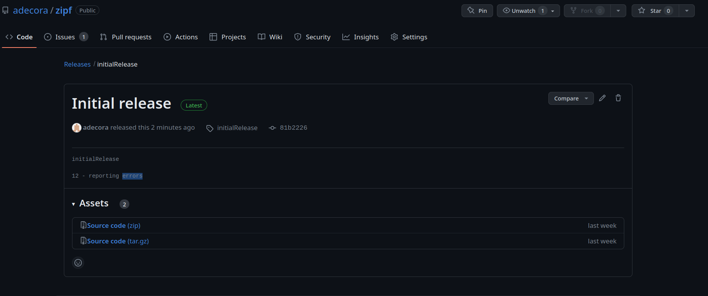

## 13.4.1. ORCID
If you don't already have an [ORCID](https://orcid.org/)*(Open Researcher and Contributor ID)*, go to the website and register now. If you do have an ORCID, log in and make sure that your details and publication record are up-to-date.

## 13.4.2. A FAIR test
An [online questionnarie](https://ardc.edu.au/resources/working-with-data/fair-data/fair-self-assessment-tool) for measuring the extent to which datasets are FAIR has been created by the Australian Research Data Commons. Fill in the questionnarie for a dataset you have published or that you use often.

## 13.4.3. Evaluate a project's data provenance
This exercise is modified from Wickes and Stein (2016) and explores the dataset from Meili (2016). Got to the dataset's page [http://doi.org/10.3886/E17507V2](http://doi.org/10.3886/E17507V2) and download the files. You will need to make an ICPSER account and agree to their data agreement before you can download.
Review  the dataset's main page to get sense of the study, then review the spreadsheet file and the coded response file.
1. Who are the participants in this study?
51 U.K. refugee lawyers were interviewed as the participants.

2. What types of data were collected and used for analysis?
Interview data, and also collects published decisions by administrative tribunals and appellate courts in the U.K.

3. Can you find information on the demographics of the interviewees?
This information is not available within the documentation.

4. This dataset is clearly in support of an article. What information can you find about it, and can you find a link to it?
We can search the dataset name and author name trying to find this.

## 13.4.4. Evaluate a project's code provenance
The GitHub repository [borstlab/reversephi_paper](https://github.com/borstlab/reversephi_paper/) provides the code and data for the paper Leonhardt et al. (2017). Browse the repository and answer the following questions:

1. Where is the software environment described? What files would you need to re-create the software environment?
Sotware requirtements are documented in **README.md**.
To re-create the `conda` environment we can use the **my_environment.yml** file.

2. Where are the data processing steps described? How could you re-create the results included in the manuscript?
Data processing and analysis steps are documented in **Makefile**.

3. How are the scripts and data archiveed? That is, where can you download the version of the code and data as it was when the manuscript was published?
The GitHub repo have a release **v1.0**, a zip file of this release could be downloaded from GitHub.

To get a feel for the different approaches to code provenance, repeat steps 1-3 with the following:
- [The figshare page](https://doi.org/10.6084/m9.figshare.7575830) that accompanies the paper Irving, Wijffels, and Chuch (2019).

1. There is a **Software environment** section, to re-create the `conda` environment we need the file called **environment.yml**.
2. On section **Processing steps** is indicated that **figure\*_log.txt** files show the computational steps performed in generating the figure, in the form of a list of commands executed at the command line.
**code.zip** is a version controlled (using git) file directory containing the code written to perform the analysis. *This code can also be found on GitHub*.
3. The **figshare** page itself is the archive.

- The GitHub repo [blab/h3n2-reassortment](https://github.com/blab/h3n2-reassortment) that accompanies the paper Potter et al. (2019).

1. Software are documented on **README.md**.
To re-create the `conda` environment we can use the file **h3n2_reassortment.yaml**.
2. Code seems to be spread across the directories **jupyter_notebooks**, **hyphy**, **flu_epidemiology** and **src**, but it isn't clear what order the code should run in, or how the components depend each other.
3. Data itself is not archived, but links are provided in the **Install requirements** section of **README.md** to documents that describe how to obtain the data.

## 13.4.5. Making permanent links
The link to the UK Home Office's [accessibility guideline posters](https://ukhomeoffice.github.io/accessibility-posters/posters/accessibility-posters.pdf) might change in future. Use the [Wayback Machine](https://web.archive.org/) to find a link that is more likely to be usable in the long run.

[Here is this link archived from March 27, 2023](https://web.archive.org/web/20230327142325/https://ukhomeoffice.github.io/accessibility-posters/posters/accessibility-posters.pdf).

## 13.4.6. Create an archive of your Zipf's analysis
A slightly less permanent alternative to haviung a DOI for your analysis code is to provide a link to a GitHub release. Follow [the instructions on GitHub](https://docs.github.com/en/github/administering-a-repository/managing-releases-in-a-repository) to create a release for the current state of your `zipf/` project.
Once you've created the release, [read about how to link to it](https://docs.github.com/en/github/administering-a-repository/linking-to-releases). What is the URL that allows direct download ofn the archive of your release?

> **What about getting a DOI?**
>	Creating a GitHub release is also necessary step to get a DOI through the Zenodo/GitHub
>	integration. We are stopping short of getting the DOI here, since nobody reading this 
>	book needs to formally cite or archive the example Zipf's Law sotware we've been developing. Also, 
>	if every reader of the book generate a DOI, we'd have to many DOIs pointing to the same code! 

[Source code (zip)](https://github.com/adecora/zipf/archive/refs/tags/initialRelease.zip)

## 13.4.7. Publishing your code
Think about a project that you're currently working on. How would you go about publishing the code associated with that project (i.e., the software description, analysis scripts, and data processing steps)?

1. Upload the code on GitHub.
2. Use a standard folder and a file structure as taught in this book.
3. Include `README`, `CONTRIBUTING`, `CONDUCT`, and `LICENSE` files.
4. Make sure these files explain how to install and configure the required software and tells people how to run the code in the project.
5. Include a `requirements.txt` file for Python package dependencies.
