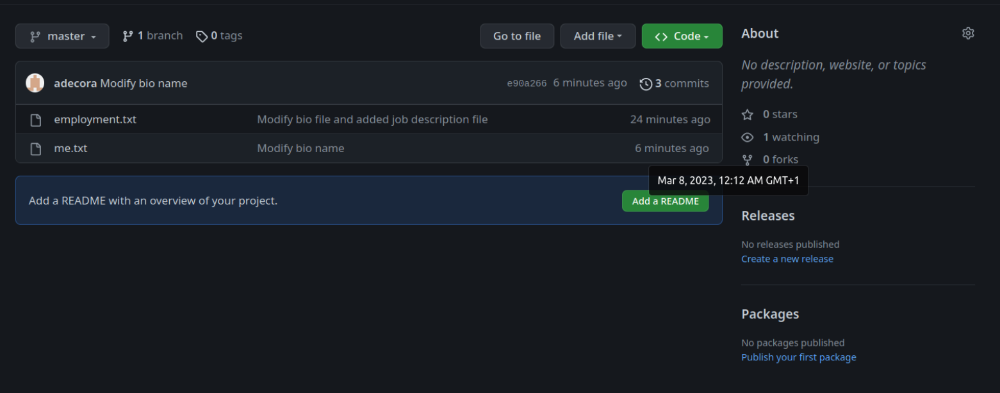
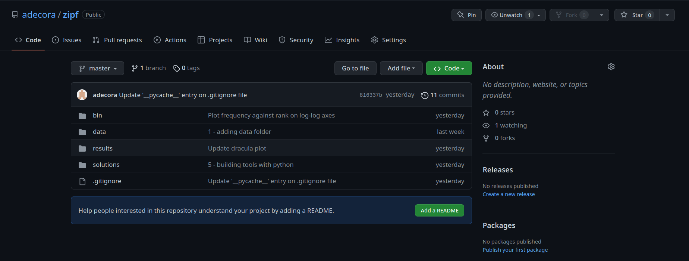
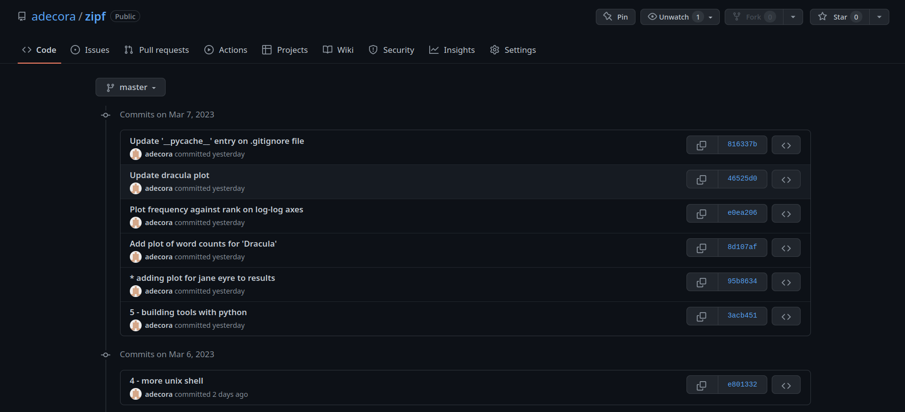

## 6.11.1. Places to create Git repositories
Along with information about the Zipf's Law project, Amira would also like to keep some notes on Heap's Law. Despite her collegues' concerns, Amira creates a **heaps-law** project inside her **zipf** project.
```bash
$ cd ~/zipf
$ mkdir heaps-law
$ cd heaps-law
$ git init heaps-law
```

Is the `git init` command that she runs inside the **heaps-law** subdirectory required for tracking files stored there?

It's not need, the **zipf** repository will track everything inside it regardless how deeplly nested.
Run `git init` in **heaps-law** subdirectory it's a problem it can interfere with each other. If someone commits something in the inner repository, Git will not know wether to record the changes in that repository, the outer one, or both.

## 6.11.2. Removing before saving
If you're working on an older version of Git, you may see an output from `git status` suggesting you can take files out of the staging area using `git rm --cached`. Try this out:
1. Create a new file in an initialized Git repository called example.txt
2. Use `git add example.txt` to add this file.
3. Use `git status` to check that Git has noticed it.
4. Use `git rm --cached example.txt` to remove it from the list of things to be saved.

What does `git status` now show? What (if anything) has happened to the file?

The file remains the same but Git no longer has it in the staging area. `git rm --cached` is equivalent to `git restore --staged`. With newer versions of Git, older commands will still work.

## 6.11.3. Viewing changes
Make a few changhes to a file in a Git repository, the view those differences using both `git diff` and `git diff --word-diff`. Which output do you find easiest to understand?

Depending the nature of the changes you are viewing.

## 6.11.4. Committing changes
> ### [Guidline to write a Git commit message](https://cbea.ms/git-commit/)
> 1. Separate the subject from the body with a blank line so that it is easy spot.
> 2. Limit subject lines to 50 characters so that they are to scan.
> 3. Write the subject line in Title Case (like a section heading).
> 4. Do not end the subject line with a period.
> 5. Write as if giving a command (e.g., "Make each plot half the width of the page").
> 6. Wrap the body (i.e., insert line breaks to format text as paragraphs rather than relying on editors to wrap lines automatically).
> 7. Use the body to explain what and why rather than how.

Which command(s) below would save changes to **myfile.txt** to a local Git repository?
```bash
# Option 1
$ git commit -m "Add recent changes"
```
It only would work if the file is already staged.

```bash
# Option2
$ git init myfile.txt
$ git commit -m "Add recent changes"
```
It would try to create a new repository, which results in an error if a repository already exists.

```bash
# Option3
$ git add myfile.txt
$ git commit -m "Add recent changes"
```
This is the correct, first add the file to the stagin area, then commits.

```bash
# Option4
$ git commit -m myfile.txt "Add recent changes"
```
Would result in an error.

## 6.11.5. Write your biography
1. Create a new Git repository on your computer called **bio**. Make sure the directory containing this repository is outside your **zipf** project directory!
2. Write a three-line biography for yourself in a filled called **me.txt** and commit your changes.
3. Modify one line and add a fourth line.
4. Display the differences between the file's original state and its updated state.
```bash
$ mkdir bio
$ cd bio
$ cat << EOF > me.txt
My name is Alex
I'm from Galicia, Spain
I'm currently living in Madrid
EOF
$ git init .
$ git add .
$ git commit -m "Short biography about me"
[master (root-commit) d12fa4c] Short biography about me
 1 file changed, 3 insertions(+)
 create mode 100644 me.txt

# We modify the file
$ cat me.txt 
My name is Alex
I'm from Lugo, Galicia
I'm currently living in Madrid
I'm working as BI consultant

$ git diff
diff --git a/me.txt b/me.txt
index ddf7c36..7e26963 100644
--- a/me.txt
+++ b/me.txt
@@ -1,3 +1,4 @@
 My name is Alex
-I'm from Galicia, Spain
+I'm from Lugo, Galicia
 I'm currently living in Madrid
+I'm working as BI consultant

$ git diff --word-diff [--color-words]          
diff --git a/me.txt b/me.txt
index ddf7c36..7e26963 100644
--- a/me.txt
+++ b/me.txt
@@ -1,3 +1,4 @@
My name is Alex
I'm from [-Galicia, Spain-]{+Lugo, Galicia+}
I'm currently living in Madrid
{+I'm working as BI consultant+}
```

## 6.11.6. Commiting multiple files
From your new **bio** directory, following after the previous exercise (which leaves you with uncommitted changes to **me.txt**):
1. Create another new file **employment.txt** and add details of your most recent job.
2. Add the new changes to both **me.txt** and **employment.txt** to the staging area and commit these changes

```bash
$ cat << EOF > employment.txt
Designing BI solutions for bussiness
EOF
$ git add .
$ git commit -m "Modify bio file and added job description file"
[master 580cfbb] Modify bio file and added job description file
 2 files changed, 3 insertions(+), 1 deletion(-)
 create mode 100644 employment.txt
```

## 6.11.7. Github timestamps
1. Create a remote repository on GitHub for your new **bio** repository.
2. Push the contents of your local repository to the remote.
3. Make change to your local repository, and push these changes as well.
4. Go to the repo you just created on GitHub and check the timestamps of the files.

How does GitHub record times, and why?
```bash
$ git remote add origin git@github.com:adecora/bio.git
$ git remote -v
origin	git@github.com:adecora/bio.git (fetch)
origin	git@github.com:adecora/bio.git (push)
$ git push origin master
Enumerating objects: 7, done.
Counting objects: 100% (7/7), done.
Delta compression using up to 16 threads
Compressing objects: 100% (5/5), done.
Writing objects: 100% (7/7), 685 bytes | 685.00 KiB/s, done.
Total 7 (delta 0), reused 0 (delta 0)
To github.com:adecora/bio.git
 * [new branch]      master -> master

# Modify a file and commit and push it.
$ cat me.txt 
My name is Alejandro
I'm from Lugo, Galicia
I'm currently living in Madrid
I'm working as BI consultant
$ git commit -a -m "Modify bio name"
$ git push origin master

$ ll     
total 8,0K
-rw-rw-r-- 1 cora cora  37 mar  7 23:50 employment.txt
-rw-rw-r-- 1 cora cora 104 mar  8 00:11 me.txt
```


GitHub display timestamps in a human-radable relative format (i.e., "24 minutes ago" ot "three weeks ago"), since this makes it easy for anyone in any time zon to know what changes have been made recently.

## 6.11.8. Workflow and history
Asume you made the following changes in your **bio** repository. What is the output of the last command in the sequence below?
```bash
$ echo "Sharing information about myself." > motivation.txt
$ git add motivation.txt
$ echo "Documenting major milestones." > motivation.txt
$ git commit -m "Motivate project"
$ git restore motivation.txt
$ cat motivation.txt
```

1. `Sharing information about myself.`**YES**.
2. `Documenting major milestones.`**NO**.
3.
```
Sharing information about myself.
Documenting major milestones.
```
**NO.**
4. An error message because we have changed `motivation.txt` without committing first.**NO.**

When we commit the staged copy of the file is `Sharing information about myself.` so this change is the one commited, meanwhile the working copy have the last change made to the file `Documenting major milestones.`. `git restore motivation.txt` replaces the working copy with the most recently committed version of the file.

## 6.11.9. Ignoring nested files
Suppose our project has a directory **results** with two subdirectories called **data** and **plots**. How would we ignore all of the files in **results/plots** but not ignore files in **results/data**?

Add this lines to **.gitignore**:
```
results/plots
```

## 6.11.10. Including specific files
How would you ignore all **.dat** files in your root directory except for **final.dat**?
*Hint: find out what the exclamation mark **!** means in a **.gitignore** file.*
```bash
$ touch {file1,file2,final}.dat
$ git status
On branch master
Untracked files:
  (use "git add <file>..." to include in what will be committed)
	file1.dat
	file2.dat
	final.dat

nothing added to commit but untracked files present (use "git add" to track)
$ cat .gitignore
# ignore .dat files
*.dat

 # exclude a particular .dat file to be ignored
!final.dat
$ git status
On branch master
Untracked files:
  (use "git add <file>..." to include in what will be committed)
	.gitignore
	final.dat

nothing added to commit but untracked files present (use "git add" to track)
```

If a file matches a pattern, but also matches a negating pattern (with **!**) defined later in the file, it will not be ignored.

## 6.11.11. Exploring the GitHub interface
Browse to your **zipf** repository on GitHub. Under the **code** tab, find and click on the text that says "NN commits" (where "NN" is some number). Hover over and click on the three buttons to the right of each commit. What information can you gather/explore from these buttons? How would you get that same information in the shell?



After click on **11 commits**.



We go to a screen with all commits, where we can:
- **Left button** copy the full SHA, we can get the same info in the shell with `git log`.
- **Middle button** view commit details, show all changes that were made in that particular commit, green shaded lines indicate additions and red lines indicate removals, we can accomplished same thing in the shell with `git diff` or `git diff FROM..TO`.
- **Right button** browse the repository at this point in the history, on the shell we must `git checkout ID`, where `ID` is the tag, branch name, or commit identifier.

## 6.11.12. Push versus commit
Explain in one or two sentences how `git push` is different from `git commit`.

With **commit** you update your local repository and with **push** you send any commits we have made locally that aren't yet in the remote repository to the remote repository.

## 6.11.13. License and README files
When we initialized our remote **zipf** GitHub repo, we didn't add a **README.md** or license file. If we had, what would have happened when we tried to link our link and remote repositories?

When GitHub creates a `README.md` file while setting up a new repository, it actually creates the repository and the commits the `README.md` file. When try to pull from the remote to our local repository, Git detects that their histories do not share a common origin and refuses to merge them.
```bash
$ git pull origin master
warning: no common commits
remote: Enumerating objects: 3, done.
remote: Counting objects: 100% (3/3), done.
remote: Total 3 (delta 0), reused 0 (delta 0), pack-reused 0
Unpacking objects: 100% (3/3), done.
From https://github.com/frances/eniac
 * branch            master     -> FETCH_HEAD
 * [new branch]      master     -> origin/master
fatal: refusing to merge unrelated histories
```

We can force Git to merge the two repositories with the option `--allow-unrelated-histories`. *Check the contents of the local and remote respositories carefully before doing this.*

## 6.11.14. Recovering older versions of a file
Amira made changes this morning to a shell script called **data_cruncher.sh** that she has been working on for weeks. Her changes broke the script, and she has noe spent an hour trying to get it back in working order. Luckily, she has been keeping track of her project's versions using Git. Which of the commands below can she use to recover the last committed version of her script?
1. `$ git checkout HEAD`
**NO** this can be dangerous, without a filename will restore all files in the current directory (and all directories below it) to the state at the commit specified, which will erase any unsaved changes you made to those files.
2. `$ git checkout HEAD data_cruncher.sh`
**YES** this restores the latest version of only the desired file.
3. `$ git checkout HEAD~1 data_cruncher.sh`
**NO** this get the version of **data_cruncher.sh** from the commit before `HEAD`.
4. `$ git checkout <unique ID of last commit> data_cruncher.sh.
**YES** the unique `ID` (identifier) of the last commit is what `HEAD` means,
5. `$ git restore data_cruncher.sh`
**YES** this is equivalent to answer 2.
6. `$ git restore HEAD`
**NO** `git restore` assumes `HEAD`, so Git will assume you're trying to restore a file called `HEAD`, resulting in an error.

## 6.11.15. Understanding `git diff`
Using your **zipf** project directory:
1. What would the command `git diff HEAD~9 bin/plotcounts.py` do if we run it?
Show the difference between the current **bin/plotcounts.py** and the same file nine commits ago.
2. What does it actually do?
If we don't have enogh commits in history, this results in an error `fatal: ambiguous argument 'HEAD~9': unknown revision or path not in the working tree`.
3. What does `git diff HEAD bin/plotcounts.py` do?
Compares changes (staged or unstaged) to the moste recent commit.

## 6.11.16. Getting rid of staged changes
`git chekout` can be used to restore a previous commit when unstaged changes have been made, but will it also work for changes that have been staged but not commited? To find out, use your **zipf** project directory to:
1. Change `bin/plotcounts.py`.
2. Use `git add` on those changes to `bin/plotcounts.py`.
3. Use `git checkout` to see if you can remove your change.

Does it work?
No, `git checkout` on a staged file does not unstaged it. The changes are in the staging area and checkout would affect the working directory.

## 6.11.7. Figuring out who did what
We never committed the last edit that removes the calculcation of inverse rank. Remove this line from `plotcounts.py`, then commit the chage:
```python
df['inverse_rank'] = 1 / df['rank']
```

Run the command `git blame bin/plotcounts.py`. What does each line of the output show?

Show the commit hash and last author on each line of a file.
*Note that the edit you just comitted is not present here, `git blame` only shows the current line in the file, and doesn't report on lines that have been removed.*