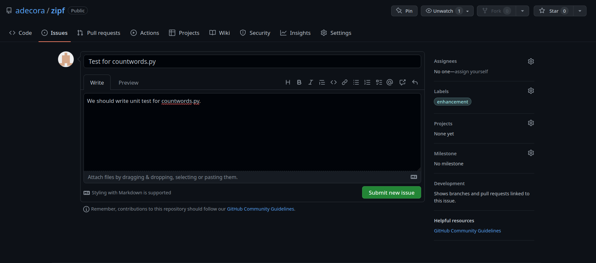
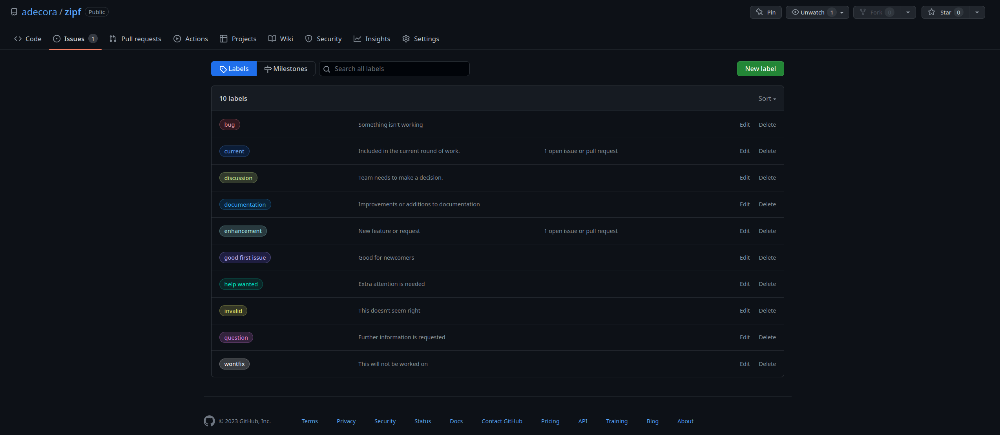
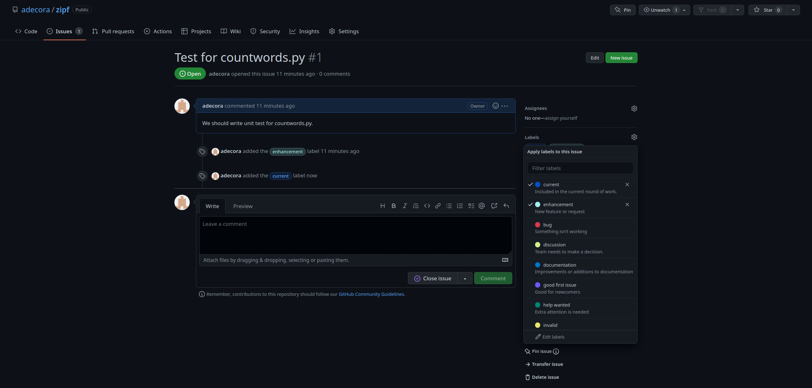

## 8.14.1. Finding information

Take a look at [the GitHub repository for this book](https://github.com/merely-useful/py-rse/). Where is the information for licensing and contributing?

- License is at [https://github.com/merely-useful/py-rse/blob/book/LICENSE.md](https://github.com/merely-useful/py-rse/blob/book/LICENSE.md).
- Contribution guidelines are at [https://github.com/merely-useful/py-rse/blob/book/CONTRIBUTING.md](https://github.com/merely-useful/py-rse/blob/book/CONTRIBUTING.md).

## 8.14.2. Add a Code of Conduct to your project
Add a **CONDUCT.md** file to your Zipf's Law project repository. Use the  [Contributor Covenant](https://www.contributor-covenant.org/) Code of Conduct template and modify the places that need updating (e.g., who to contact). Be sure to edit the contact information in both before committing the files.

```

# Contributor Covenant Code of Conduct

## Our Pledge

We as members, contributors, and leaders pledge to make participation in our
community a harassment-free experience for everyone, regardless of age, body
size, visible or invisible disability, ethnicity, sex characteristics, gender
identity and expression, level of experience, education, socio-economic status,
nationality, personal appearance, race, caste, color, religion, or sexual
identity and orientation.

We pledge to act and interact in ways that contribute to an open, welcoming,
diverse, inclusive, and healthy community.

## Our Standards

Examples of behavior that contributes to a positive environment for our
community include:

* Demonstrating empathy and kindness toward other people
* Being respectful of differing opinions, viewpoints, and experiences
* Giving and gracefully accepting constructive feedback
* Accepting responsibility and apologizing to those affected by our mistakes,
  and learning from the experience
* Focusing on what is best not just for us as individuals, but for the overall
  community
...
```

## 8.14.3. Add a license to your project
Add either an MIT or a GPL **LICENSE.md** file to your Zipf's Law project repository. Modify the contents to include you full name and year.

```
MIT License

Copyright (c) 2023 Alejandro de Cora

Permission is hereby granted, free of charge, to any person
obtaining a copy of this software and associated documentation
files (the "Software"), to deal in the Software without
restriction, including without limitation the rights to use,
copy, modify, merge, publish, distribute, sublicense, and/or
sell copies of the Software, and to permit persons to whom the
Software is furnished to do so, subject to the following
conditions:

The above copyright notice and this permission notice shall be
included in all copies or substantial portions of the Software.

THE SOFTWARE IS PROVIDED "AS IS", WITHOUT WARRANTY OF ANY KIND,
EXPRESS OR IMPLIED, INCLUDING BUT NOT LIMITED TO THE WARRANTIES
OF MERCHANTABILITY, FITNESS FOR A PARTICULAR PURPOSE AND
NONINFRINGEMENT. IN NO EVENT SHALL THE AUTHORS OR COPYRIGHT
HOLDERS BE LIABLE FOR ANY CLAIM, DAMAGES OR OTHER LIABILITY,
WHETHER IN AN ACTION OF CONTRACT, TORT OR OTHERWISE, ARISING
FROM, OUT OF OR IN CONNECTION WITH THE SOFTWARE OR THE USE OR
OTHER DEALINGS IN THE SOFTWARE.
```


## 8.14.4. Adding contribution guidelines
1. Add a section to the **README.md** file in the Zipf's Law project to tell people where to find out more about contributing.
2. Add a **CONTRIBUTING.md** file in the Zipf's Law project to describe how other people can contribute to it.
Be sure to add it to the root directory of your Git repository, so that when someone open a pull request or creates an issue on GitHub, they will be presented with a link to the CONTRIBUTING file (see the [GitHub contributors guide](https://docs.github.com/en/github/building-a-strong-community/setting-guidelines-for-repository-contributors) for details).

The text in the **README.md** might look something like:

```
## Contributing
Interested in contributing?
Check out the [CONTRIBUTING.md](./CONTRIBUTING.md)
file for guidelines on how to contribute.
Please note that this project is released with a
[Contributor Code of Conduct](./CODE_OF_CONDUCT.md).
By contributing to this project,
you agree to abide by its terms.
```

Your **CONTRIBUTING.md** file might look somehting like the following:
```
# Contributing

Thank you for your interest
in contributing to the Zipf's Law package!

If you are new to the package and/or
collaborative code development on GitHub,
feel free to discuss any suggested changes via issue or email.
We can then walk you through the pull request process if need be.
As the project grows,
we intend to develop more detailed guidelines for submitting
bug reports and feature requests.

We also have a code of conduct
(see [`CODE_OF_CONDUCT.md`](./CODE_OF_CONDUCT.md)).
Please follow it in all your interactions with the project.
```

## 8.14.5. File an issue
Create a feature request issue in your Zipf's Law project repository to ask that unit tests be written for **countwords.py**.


We labeling the issue as **enhancement** something that someone wants added to the software.

## 8.14.6. Label issues
1. Create the labels *current* and *discussion* to help organize and prioritize your issues.
2. Delete at least one of the labels that GitHub automatically created for you.
3. Apply at least one label to each issue in your repository.



We often delete the **duplicate** label: when we mark an issue that way we (almost) always add a comment saying which issue it's a duplicate of, in which case it's just as sensible to label the issue **wontfix**.



## 8.14.7. Balancing individual and team needs
A new member of your team has a medically diagnosed attention disorder. In order to help themselves focus, they need to talk to themselves while coding. Several other members of your team have come to you privately to say that they find this distracting. What steps would you take?

Some solutions can be:
- Give the team member their own office space so they don't distract others.
- Buy noise-cancelling headphones for the employees that find it distracting.
- Re-arrange the work spaces so that there is a "quiet office" and a regular office space and hace the team member with the attention disorder work in the regular office.

## 8.14.8. Crediting invisible contributions
Your team has a rule: if someone's name appears in the Git history for a project, they are listed as co-author on papers for that project. A new member of your team has complained that this is unfair: people who haven't contributed for over two years are still being included as authors, while they aren't included because the many hours they have spent doing code reviews don't show up in the Git history. How would you address this issue?

Possible solutions:
- Change the rule so that anyone who contributes to the project, in any way, gets included as a co-author.
- Update the rule to include a contributor list on all projects with descriptions of duties, roles, and tasks the contributor provided for the project.

## 8.14.9. Who are you?
Which (if any) of the following profiles describes you best? How would you help each of these people if they were on your team?
- *Anna* thinks she knows more about every subject than everyone else on the team put together. No matter what you say, she'll correct you; no matter what you know, she knows better. If you keep track in team meetings of hhow often people interrupt one another, her score is usually higher than everyone else's put together.
- *Bao* is a contrarian: no matter what anyone says, he'll take the opposite side. This is healthy in a small doses, but when Bao does it, there's another objection lurking behind the first half dozen.
- *Frank* believes that knowledge is power. He enjoys knowing things that other people don'--or to be more accurate, he enjoys it when people know he know things they don't. Frank can actually make things work, but when asked how he did it, he'll grin and say, "Oh, I'm sure you can figure it out."
- *Hediyeh* is quiet. Very quiet. She never speaks up in meetings, even when she knows that what toher people are saying is wrong. She might contribute to the mailing list, but she's very sensitive to criticism, and will always back down rather than defending her point of view.
- *Kenny* is a hichhiker. He has discovered that most people would rather shoulder some extra work than snitch, and he takes advantage of it every turn. The frustrating thing is that he's so damn plausible when someone finally confront him. "There have been mistakes on all sides", he says, or "Wekk, I think you're nit-picking".
- *Melissa* would easily have made the varsity procastination team if she'd bothered to show up to tryouts. She means well--she really does feel bad about letting people down--but somehow her task are never finished until the last possibkle moment. Of course, that means that everyone who is depending one her can't do their work until the last possible moment.
- *Petra*'s favorite phrase is "why don't we." Whu don't we write a GUI to help people edit the program's configuration files? Hey, why don't we invent our own little language for designing GUIs?
- *Raj* is rude. "It's just the way I talk", he says. "If you can'y hack it, maybe you should find another team". His favorite phrase is, "That's stupid", and he uses obscenity in every second sentence.

	- Use *three sticky notes* and *interruption bingo* to stop Anna from cutting people off.
	- Tell Bao that the devil doesn't need more advocates, and that he's only allowed one "but what about" at a time.
	- Hediyeh's lack of self-confidence will take a long time to remedy. Keeping a list of the times she's been right and reminding her of them frequently is a start, but the real fix is to create and mantain a supportive environment.
	- Unmasking Kenny's hitchhiking will feel like nit-picking, but so does the accounting required to pin down other forms of fraud. The most important thing is to have the discuccion in the open so that everyone relizes he's taking credit for everyone else's work as well as theirs.
	- Melissa needs a running partner--someone to work beside her so that she starts when she should and doesn't get distracted. If that doesn't work, the project may need to ssign everything mission-critical to someone else (which will probably lead to her leaving).
	- Petra can be managed with a one-for-one rule: each time she builds or fixes something that someone else needs, seh can then work on something she thinks cool. However, she's only allowed to add whatever it is to the project if someone else will publicly commit to maintaining it.
	- Get Frank and Raj off your project as quickly as you can.